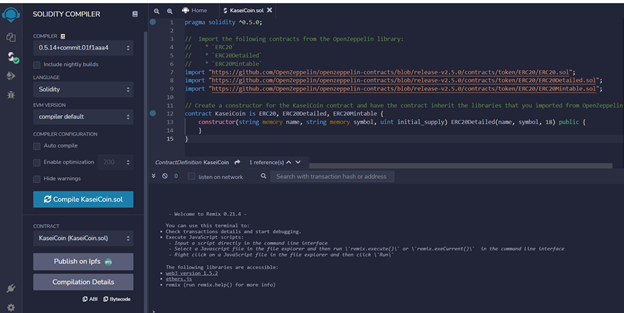
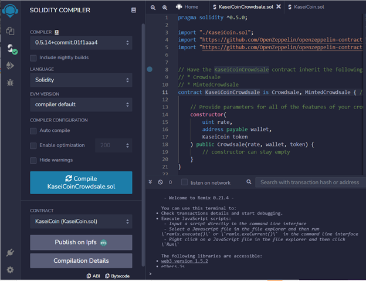
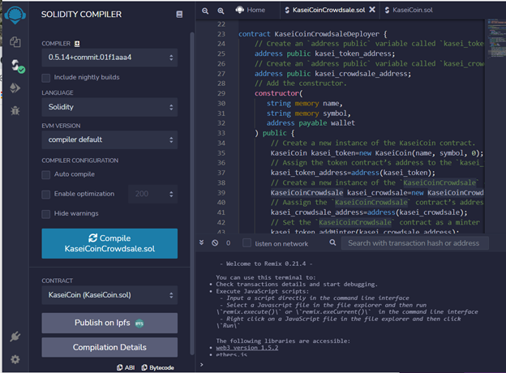
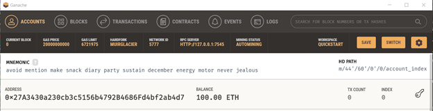
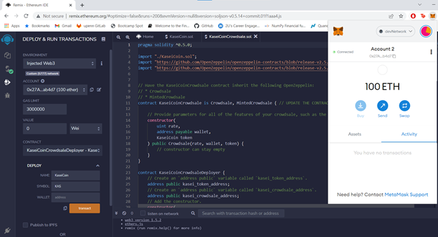
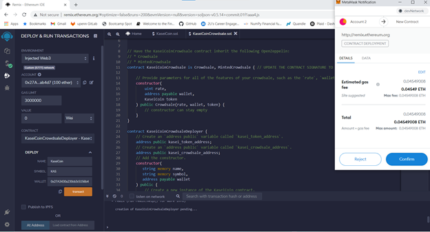
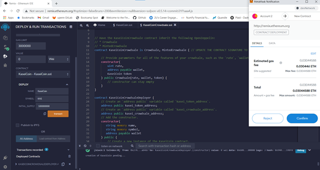
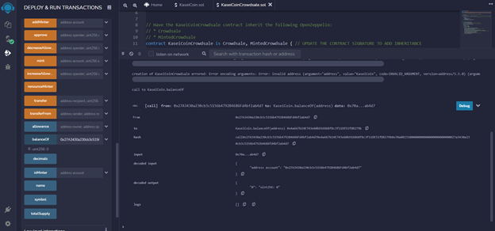
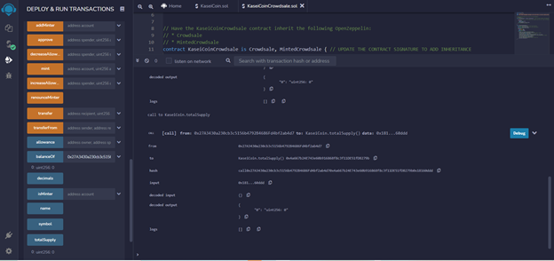

# Advanced-Solidity

This project involves creating a monetary system for the new Mars colony based on blockchain technology and a new cryptocurrency named KaseiCoin. KaseiCoin token contract was developed as a smart contract that defines KaseiCoin as an ERC-20 token. The contract inherits from ERC20, ERC20Detailed, and ERC20Mintable contracts from OpenZeppelin library. The KaseiCoinCrowdsale contract was also created and manages the entire crowd sale process. The contract automatically mints the tokens and distributes them to a buyer in one transaction. The KaseiCoin deployer contract was created to deploy the KaseiCoin and KaseiCoinCrowdsale contracts. Finally, the crowd sale was deployed and tested on a local blockchain. The code was compiled and debugged as necessary. A successful compilation screenshot was taken for each contract and included in the Evaluation Evidence section of the README.md file.

# Evaluation Evidence

